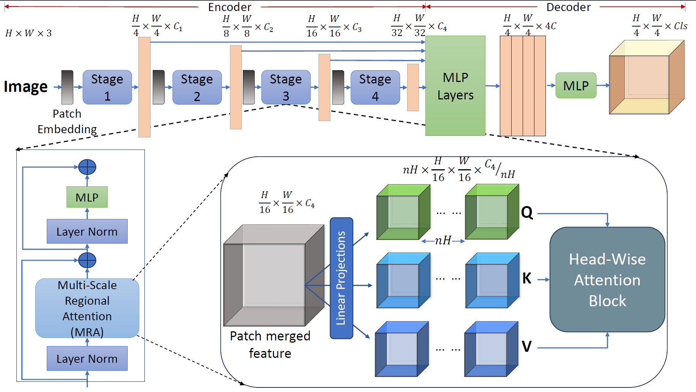

## Model Architecture

To accomplish high-resolution vision tasks, our model follows a standard hierarchical design that captures high-resolution feature maps across different stages. An overview of the architecture is illustrated in the following figure:

Given an input image of dimension $H \times W \times 3$, it's initially divided into $4\times4$ patches, resulting in $\frac{H}{4}\times\frac{W}{4}$ visual tokens of size $4\times4\times3$. These patches undergo overlap patch merging, projecting them into hidden features of dimension $C_1$. The spatial feature then traverses through four stages of multi-scale regional Transformer blocks. At each stage, the feature is downsampled by 2 via a patch merging/embedding layer. After stage $i$, patch merging is applied to obtain the hierarchical feature map $F_i$ with dimension $\frac{H}{2^{i+1}}\times \frac{H}{2^{i+1}}\times C_i$, where $i \in \{1,2,3,4\}$ and $C_{i+1} > C_i$.

High-resolution inputs pose challenges with full-scale global attention due to computational complexity. Standard local or window attention focuses on tokens from local neighborhoods but suffers from limited receptive fields within each locality and weak long-range dependencies across localities, crucial for pixel-level inference. Several approaches have been proposed to extend the receptive field and enhance information sharing among neighboring local windows.
