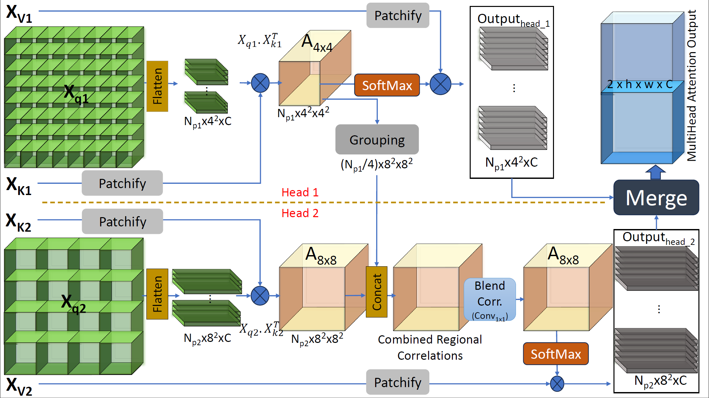

## Multi-scale Region Attention

The multi-scale region attention method enhances attention mechanisms in transformer models. It achieves this by:

- **Window-based Attention:** Dividing the input feature map into windows allows localized focus but lacks broader context.
  
- **Multi-scale Window Approach:** Splitting heads into different window sizes (e.g., head 1 focusing on smaller windows, head 2 on larger ones) merges outputs to capture both local and broader context efficiently.

- **Correlation Grouping:** Introducing a mechanism to merge context across different window scales enhances contextual relationships between smaller and larger windows. This enriches the attention mechanism.

This approach empowers models to capture both fine-grained and global information, significantly improving their ability to handle diverse visual features.
